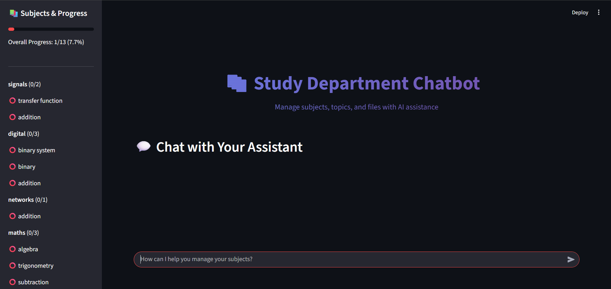
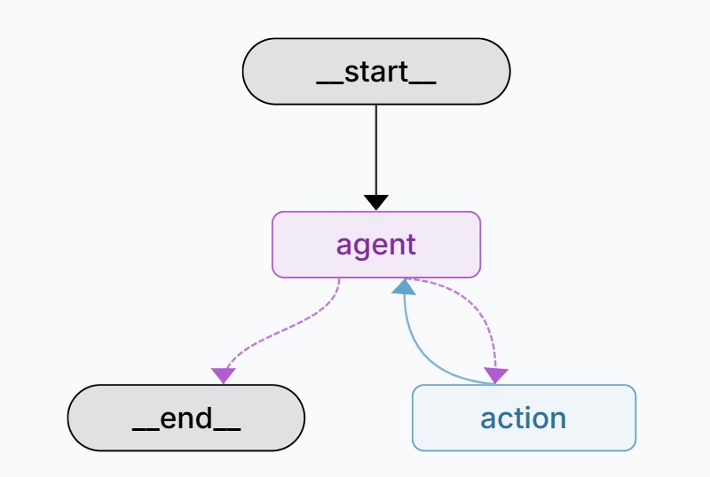

# 🎓 Student Assistant
An AI-powered academic assistant web app designed to help students to manage **subjects, topics, and study realted queries**.  
It integrates a **chatbot interface**, **MongoDB persistence**, and **file-based context (CSV/PDF)** to enhance learning.  

---

## 🚀 Features

### 💬 AI-Powered Chatbot
- Built using **Google Generative AI (Gemini 1.5 Flash)** with LangChain.
- Understands natural language queries for managing subjects & topics.
- Integrates tools for:
  - Adding/Deleting subjects
  - Adding/Listing/Deleting topics
  - Marking topics complete / incomplete
  - Finding which subject a topic belongs to
  - Bulk topic operations (all/multiple subjects)

<p align="center">
  
</p>

---

### 📚 Subject & Topic Management
- Persistent storage in **MongoDB**.
- Completion tracking with ✅ / ❌ per topic.
- Sidebar shows:
  - Overall progress bar
  - Subject-wise breakdown
  - Quick stats (incomplete topics left)
- Supports **subject creation, deletion, and listing**.
- Allows **adding/removing topics** under specific or multiple subjects.

### 📂 File Upload Support
- Upload **CSV files** (automatically parsed into a Pandas DataFrame).
- Upload **PDF files** (text extracted via PyMuPDF).
- Data can be used as **context for chatbot queries**.

### 🗄️ Database Integration
- MongoDB stores all subjects and topics.
- Ensures **no duplicates** with `$addToSet`.
- Supports flexible queries for subject-topic relationships.

### 🧾 Planned DataFrame Agent (WIP)
- Uses `create_pandas_dataframe_agent` to query CSV data with natural language.
- Will allow Q&A over uploaded datasets (future enhancement).

---

## 🛠️ Tech Stack

| Category       | Technologies Used |
|----------------|------------------|
| Frontend       | Streamlit (Chat UI + Sidebar) |
| Backend        | LangChain + LangGraph |
| Database       | MongoDB (via PyMongo) |
| LLM            | Google Generative AI (Gemini 1.5 Flash) |
| File Parsing   | Pandas (CSV), PyMuPDF (PDF) |
| Environment    | Python (dotenv for config) |

---

## 🧩 Project Structure
student-assistant/
│── study_dep.py # Core Graph & Tool setup
│── app.py # Streamlit chatbot UI
│── requirements.txt # Dependencies
│── .env # API keys & Mongo URI
│── README.md # Documentation


---

## 🖇️ System Architecture

The Student Assistant is powered by LangGraph, which controls how the chatbot interacts with user queries, database operations, and actions.

<p align="center">
  
</p>


---

## 🔌 API Keys & Configuration

### 🔐 API Keys:
- **Google Generative AI API Key** (for LLM responses)  
- **MongoDB URI** (for subject/topic persistence)  

### 📁 Add `.env` file:
```bash
GOOGLE_API_KEY=your_gemini_key
MONGO_URI=your_mongodb_uri
```

## 🧪 Setup Instructions

Clone the Repository

```bash
git clone https://github.com/yourusername/student-assistant.git
cd student-assistant
```


Set up Virtual Environment

```bash
python -m venv .venv
source .venv/bin/activate   # (Linux/Mac)
.venv\Scripts\activate      # (Windows)
```


Install Dependencies

```bash
pip install -r requirements.txt
```


Run Streamlit App

```bash
streamlit run app.py
```


Then open your browser at 👉 http://localhost:8501

---

## 📅 Planned Enhancements

- 📊 **DataFrame Query Tool** → Ask natural language questions over uploaded CSVs.  
- 🧠 **AI-Generated Study Plans** → Automatically generate revision schedules from subjects & topics.  
- 🌐 **Multilingual Support** → Chat in Hindi/other Indian languages.  
- 🗣️ **Voice Interaction** → Add support for voice-based question input and text-to-speech (TTS) responses.  
- 📱 **PWA Support** → Use as a mobile-friendly app with offline caching.  
- 📈 **Analytics Dashboard** → Track study progress & chatbot usage stats.  

